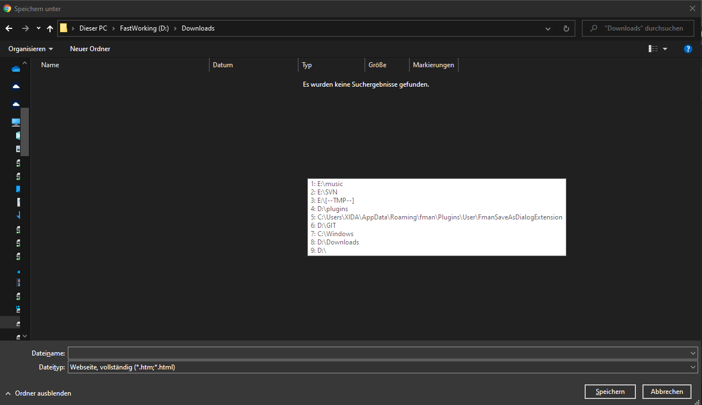

# FmanSaveAsDialogExtension
[FMan](https://www.fman.io) Plugin to use your last used directories from FMan within the windows save dialog

# Install
install the plugin by copying the release to 
> %AppData%\Roaming\fman\Plugins\User

Reload Plugins from within fman.io

Or just use the "install plugin" function from within fman and search for FmanSaveAsDialogExtension.

# Usage
When the plugin starts the *lastdirectories.exe* will be automatically started.
You can see that it is running because it has a systray icon.
From now on the plugin will remember the last 9 directories you used in fman.

Now whenever a windows save as / open dialog is active you can press *F9* to show the list of the last directories

Press a digit from 1-9 on your keyboard to set the save as / open dialog to that path.
Or press any other key to cancel.

When you exit fman the *lastdirectories.exe* will be killed.
